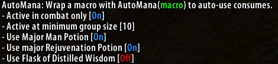
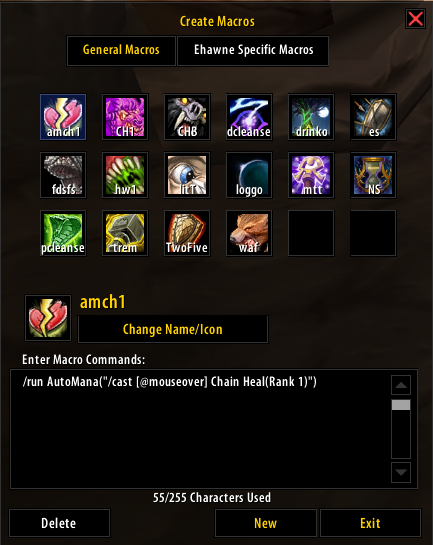
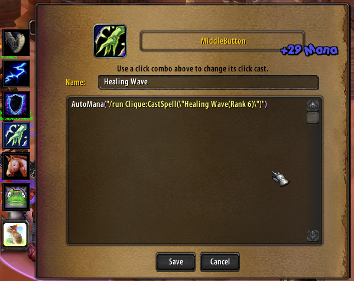

AutoMana
===
An addon to manage your mana consuming in Turtle WoW.  
---
This addon uses mana consumes as soon as possible when you have enough mana missing. This means the items will be off cooldown sooner as you can't miss out on using them and can result in considerably more available mana throughout a fight.  

I've previously made some macros that do this for you but having to toggle settings on more than one spell when I wanted to change my consume use on the fly was quite painful. To that end I've made this addon that can wrap your casts and then your settings can be changed centrally and on the fly via `/automana`  
This is particularly useful for toggling mana potion use since on some bosses you don't care too much about potion cooldown.  

The current settings are:
* Toggle the addon being enabled
* Toggle whether to use consumes only in combat
* Choose the size of group you need to be in for the addon be active
* Toggle using tea
* Toggle using potions at all, this means Major Mana Potion or Major Rejuvenation Potion
* Toggle using Major Rejuvenation Potion
* Toggle using Flask of Distilled Wisdom if you run out of mana

Using a flask sets your mana to 2k if you have less than this, which means it's suitable as an (expensive) emergency potion.  
If enabled, Major Rejuvenation will be used instead of Major Mana if you're missing enough health to benefit from it.  

# The settings menu in game:  

# Wrapping a normal or roid macro to use AutoMana:

# Wrapping a Clique cast to use AutoMana:

* This addon is made by and for `Weird Vibes` of Turtle WoW.  